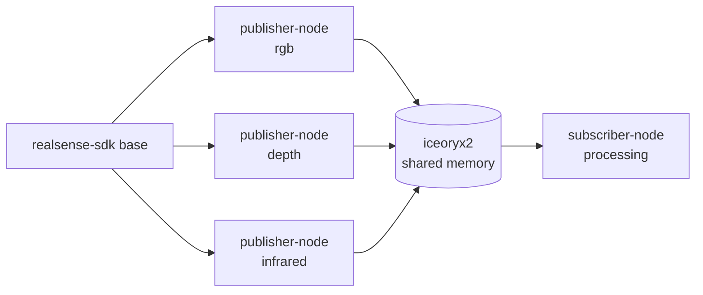

# RealSense SDK Base Container

Base image for the RealSense pipeline on a NVIDIA Jetson Orin (JetPack 6.1).  
Nothing runs here — this is the SDK layer that publisher nodes build on top of.

## Architecture

The goal is to mimic a multi-camera setup where each stream is its own publisher node sharing data over iceoryx2 shared memory:



Each publisher node is a separate container that inherits this SDK base.  
Subscriber nodes only need iceoryx2 — no RealSense SDK required.


## Build

```bash
docker compose build
```

## Test

```bash
docker compose run --rm realsense-sdk
```

This runs `rs-enumerate-devices` inside the container. If the host driver is set up correctly you should see all connected cameras listed with their serial numbers and supported stream profiles.
