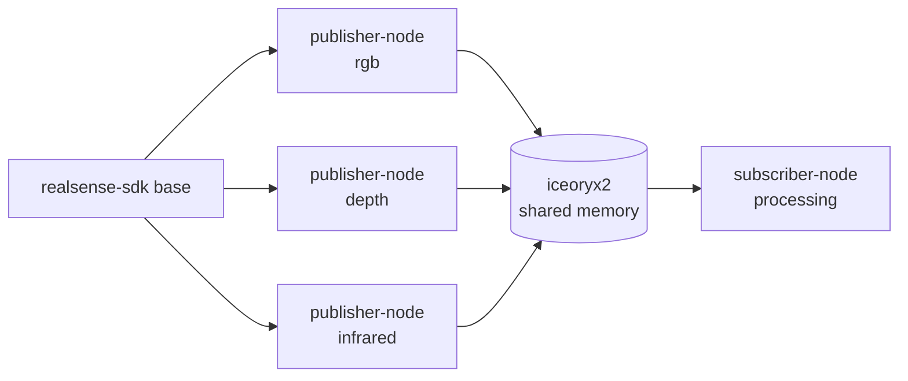

```mermaid
graph LR
    SDK[realsense-sdk base]
 
    SDK --> RGB[publisher-node\nrgb]
    SDK --> DEPTH[publisher-node\ndepth]
    SDK --> IR[publisher-node\ninfrared]
 
    RGB --> SHM[(iceoryx2\nshared memory)]
    DEPTH --> SHM
    IR --> SHM
    SHM --> S2[subscriber-node\nprocessing]
```
